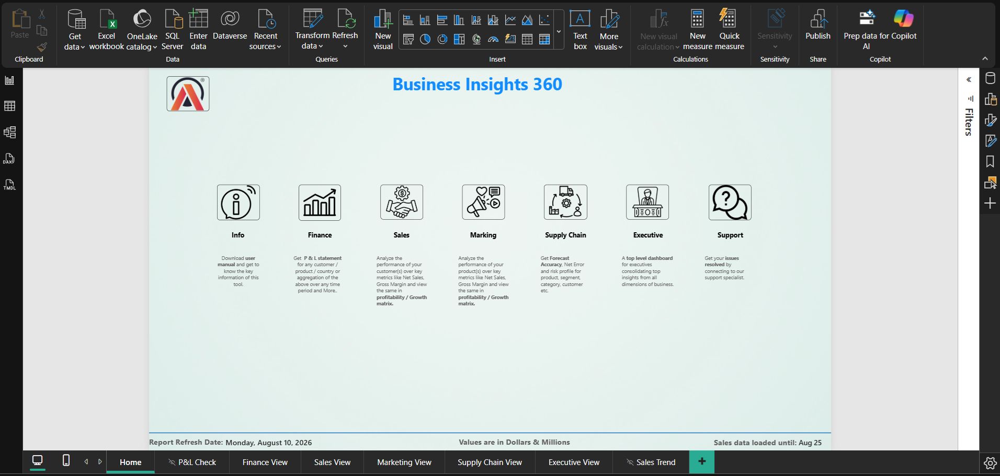

# 📊 AtliQ Business Insights 360° | Power BI Dashboard

## 📌 Project Overview

This project is an end-to-end **Business Intelligence solution** developed in **Power BI** for **AtliQ Hardware**, a global consumer electronics company.

The dashboard provides a comprehensive **360° business view** by integrating Finance, Sales, Marketing, Supply Chain, and Executive insights into one interactive reporting solution.

The objective is to transform raw business data into meaningful insights that help stakeholders make faster, data-driven decisions.

---

# 🏢 Business Problem

AtliQ Hardware operates across multiple countries, customers, and product categories. As the company expanded, each department relied on separate reports and spreadsheets, making it difficult to gain a unified view of business performance.

Some of the major challenges included:

- Lack of centralized reporting
- Difficulty monitoring financial performance
- Limited visibility into customer and product performance
- Inability to analyze market share effectively
- Poor visibility into supply chain efficiency
- Time-consuming manual reporting
- Delayed executive decision-making

The business required a centralized reporting solution that could consolidate insights from multiple departments into one platform.

---

# 💡 Solution

Developed an interactive Power BI dashboard that integrates data from multiple business functions into a single reporting platform.

The solution enables stakeholders to:

- Monitor key business KPIs
- Compare Actual vs Benchmark performance
- Analyze profitability
- Evaluate customer and product performance
- Track market share
- Monitor supply chain efficiency
- Enable executives to make informed strategic decisions

The report includes dynamic DAX measures, interactive slicers, bookmarks, drill-through functionality, conditional formatting, and custom tooltips to enhance user experience.

---

# 📈 Dashboard Views

## 🏠 Home

Acts as the navigation page for all dashboards.

### Features

- Interactive navigation buttons
- Bookmark-based page navigation
- Easy access to each business view

---

## 💰 Finance View

### Business Objective

Analyze the company's financial performance and profitability.

### Key KPIs

- Net Sales
- Gross Margin %
- Net Profit %
- Gross Margin Variance
- Net Profit Variance
- Revenue Contribution

### Business Value

- Tracks financial health
- Identifies profitable and underperforming business segments
- Supports financial planning and decision-making

---

## 📊 Sales View

### Business Objective

Analyze sales performance across customers, products, and regions.

### Key KPIs

- Net Sales
- Customer Performance
- Product Performance
- Revenue Contribution
- Market Share

### Business Value

- Identifies top-performing customers
- Highlights revenue opportunities
- Supports sales strategy

### Interactive Feature

A custom tooltip provides additional business details when hovering over visuals, allowing users to gain deeper insights without navigating away from the report.

### Custom Tooltip

---

## 📣 Marketing View

### Business Objective

Evaluate product performance and market competitiveness.

### Key KPIs

- Market Share
- Revenue Contribution
- Customer Segmentation
- Regional Analysis

### Business Value

- Identifies growth opportunities
- Measures market competitiveness
- Supports marketing decisions

---

## 🚚 Supply Chain View

### Business Objective

Monitor forecasting accuracy and operational efficiency.

### Key KPIs

- Forecast Accuracy
- Net Error
- Service Level

### Business Value

- Improves inventory planning
- Enhances forecasting accuracy
- Optimizes supply chain operations

---

## 📈 Executive View

### Business Objective

Provide leadership with an overall business overview.

### Key KPIs

- Revenue
- Gross Margin
- Net Profit
- Market Share
- Revenue Trend

### Business Value

- Consolidates insights from all departments
- Supports strategic planning
- Enables faster executive decision-making

---

# ✨ Key Features

- Interactive dashboard navigation
- Dynamic DAX measures
- Custom tooltip pages
- Drill-through analysis
- Conditional formatting
- KPI cards
- Responsive slicers
- Business storytelling

---

# 🛠 Tools & Technologies

- Power BI Desktop
- Power Query
- DAX
- SQL
- Excel
- Data Modeling

---

# 📚 Skills Demonstrated

- Data Cleaning
- Data Modeling
- DAX Calculations
- KPI Development
- Business Intelligence
- Dashboard Design
- Data Visualization
- Business Storytelling

---

# 🚀 Power BI Live Report

🔗 **[Click here to view the Live Power BI Dashboard](https://app.powerbi.com/view?r=eyJrIjoiZGEyNGMzMTktNzFiYi00YmI5LTkxYWQtNzM5ODY5ZTQ0MDFlIiwidCI6ImM2ZTU0OWIzLTVmNDUtNDAzMi1hYWU5LWQ0MjQ0ZGM1YjJjNCJ9)**

---

# 🚀 Key Learnings

- Developed an end-to-end Business Intelligence solution
- Built advanced DAX measures for business KPIs
- Designed an interactive reporting experience using bookmarks, slicers, and tooltips
- Applied data modeling best practices
- Converted business requirements into actionable insights

---

# 👩‍💻 Author

**Amol Ashok Idhate**

Aspiring Data Analyst

**GitHub:** [Amol-Idhate](https://github.com/Amol-Idhate)

**LinkedIn:** [Amol Ashok Idhate | LinkedIn](https://www.linkedin.com/in/amol-ashok-idhate-691b753b2/)
